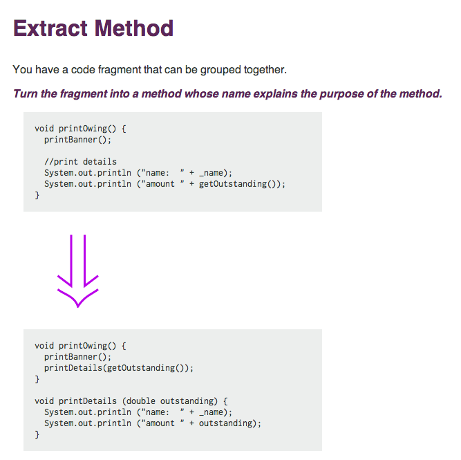
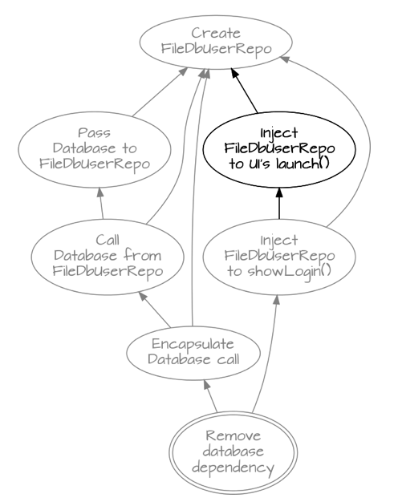

# Long Refactorings

 
 

## Rick Bradley
### GitHub, Inc.

---

### github.com/rick

---

## long refactorings
 

---

## long refactorings are simply refactorings
### only, (IN HINDSIGHT) they end up taking a lot longer than most refactorings

---

### Stepping back for a second...
## What *is* "refactoring"?

---

## Refactoring...

 

### **"behavior-preserving changes to the implementation of a system"**

---

---

 

 

 

`http://refactoring.com/catalog/extractMethod.html`

---

 

 

 

`http://refactoring.com/catalog/inlineMethod.html`

---

## **"behavior-preserving changes to the implementation of a system"**

 

### This is really only true for the smallest of refactorings.

 
 

### In larger-scale refactorings we're typically chaining together a series of behavior-preserving changes, interspersed with behavior changes.

 

### The important things are to always know which is which, and to do them intentionally.

---

## why do we refactor?

---

### **wankery**

---

### (primarily)

---

### but also...

---

### to understand the system

---

### to understand the system
### to bring behavior under test

---

### to understand the system
### to bring behavior under test
### to extract code for reuse

---

### to understand the system
### to bring behavior under test
### to extract code for reuse
### to improve some facet of the system (performance, memory use, coupling, cohesion, etc., etc., etc.)

---

### to understand the system
### to bring behavior under test
### to extract code for reuse
### to improve some facet of the system (performance, memory use, coupling, cohesion, etc., etc., etc.)
### to reuse existing code elsewhere

---

### to understand the system
### to bring behavior under test
### to extract code for reuse
### to improve some facet of the system (performance, memory use, coupling, cohesion, etc., etc., etc.)
### to reuse existing code elsewhere
### to make room for a new feature

---

### to understand the system
### to bring behavior under test
### to extract code for reuse
### to improve some facet of the system (performance, memory use, coupling, cohesion, etc., etc., etc.)
### to reuse existing code elsewhere
### to make room for a new feature
### to prepare to fix a bug

---

### to understand the system
### to bring behavior under test
### to extract code for reuse
### to improve some facet of the system (performance, memory use, coupling, cohesion, etc., etc., etc.)
### to reuse existing code elsewhere
### to make room for a new feature
### to prepare to fix a bug
### ...

---

### to understand the system
### to bring behavior under test
### to extract code for reuse
### to improve some facet of the system (performance, memory use, coupling, cohesion, etc., etc., etc.)
### to reuse existing code elsewhere
### to make room for a new feature
### to prepare to fix a bug

 

### (and usually, still, quite a bit of)

 

## wankery

---

## optimization
 
 

---

## optimization
 
### no, I mean, like, life optimization

---

## refactoring a toy system

---

## refactoring a toy system

### it could be for learning purposes
### or perhaps the hope is that some day it will grow up to be a big system
#### one that someone has a use for

---

## refactoring a toy system

### The value is in building something useful

 

### Even here, though, we have finite time and resources
### So we choose what to work on

---

## refactoring a system that people are actively using

---

### Again, limited time and resources,
### so we must make choices about what to work on,
### because the time spent on one thing cannot be spent on another.

---

## refactoring to understand a system
### &nbsp;

---

## refactoring to understand a system
### is useful if it is directed towards implementing a feature or fixing a bug
---

## refactoring to bring behavior under test
### &nbsp;
### &nbsp;

---

## refactoring to bring behavior under test
### &nbsp;
### &nbsp;

---

## refactoring to bring behavior under test
### is wasteful, unless it's being immediately driven by fixing a bug or implementing a feature

---

## refactoring to extract code for reuse
### &nbsp;
### &nbsp;

---

## refactoring to extract code for reuse
### is wasteful, unless we have reached the point where a new feature is ready to use that extraction

---

## refactoring to improve some facet of the system
### &nbsp;
### &nbsp;

---

## refactoring to improve some facet of the system
### is generally a good reason to refactor, if this is the most important thing you could be working on right now

---

## refactoring to make room for a new feature
### &nbsp;

---

## refactoring to make room for a new feature
### is great, presuming you're implementing that feature right now

---

## refactoring to prepare to fix a bug
### &nbsp;

---

## refactoring to prepare to fix a bug
### also great, if you're fixing the bug right now

---

---

## optimization
### part deux

---

## most refactorings are small or trivial

 

### There's really no estimation involved:
### look at the code, start making the changes.

 

### We're using techniques in Martin Fowler's _Refactoring_ book.

 

### The refactorings are a commit or few,
### inside the boundary of a larger pull request,
### dedicated to a feature or a bugfix.

---

## many refactorings are a bit larger

 

### Suitable for a pair of programmers working on an afternoon,
### we can estimate them fairly accurately or do without estimation.

 
### We can use simple tools and processes, like feature branches, pair programming, a second or third Pull Request.

 

### We start to use more advanced techniques.

---

## We start to draw on these techniques

 

### characterization testing, refactoring to tests, sensing variables, etc.

---

---

---

## We eventually encounter refactorings that we know are projects

---

## We eventually encounter refactorings that we know are projects

 

### These refactorings are non-trivial and perhaps not even possible.
### Even the process of estimation is difficult.

---

 

### We only consider them because they are roadblocks to important features, or there are real quality problems in this part of the system, and piecemeal attempts at bugfixing fail to eliminate problems.

---

### Developers who go into these areas come back angry and muttering, they turn to the solace of drink.

 

 

## Good people are reduced to bad things.

---

## Tackling these ugly jobs is what we're here to talk about.

---

## So how do we tackle these huge refactorings?

---

## There are enough risks that success is unlikely

 

### &nbsp;
### &nbsp;
---

## There are enough risks that success is unlikely

 

### So, aim to minimize costs.
### &nbsp;

---

## There are enough risks that success is unlikely

 

### Aim to never be a roadblock.
### &nbsp;

---

## There are enough risks that success is unlikely

 

### Avoid building the Second System™ -- the promised land of endless biscuits and gravy.

---

## There are enough risks that success is unlikely

 

### Integrate constantly.  Long-running branches are kryptonite.
### &nbsp;
---

## There are enough risks that success is unlikely

 

### Don't go in for Flag Day.
### &nbsp;
---

## There are enough risks that success is unlikely

 

### When the project "lands", it's quietly been in use for weeks or months already.
---

## There are enough risks that success is unlikely

 

### Be like water.
### &nbsp;

---

---

 

## Start with exploration

 

### Spec out possible alternate architectures as proofs of concept.
### &nbsp;

---

 

## Start with exploration

 

### Various people in ones and twos take stabs at feasibility over the course of months or years.

---

 

## Start with exploration

 

### Do throw-away experimental refactorings of a smaller scope just to see if a large refactoring might be possible.

---

 

### use techniques like those from _The Mikado Method_ to even explore the possible refactorings

---

 1. Start with a goal
 2. Do the first small refactoring along the way
 3. See what breaks -- write down a graph node
 4. Repeat until no more dependencies

---

## getting real

---

## "abilities"

---

## Image credits:

https://www.flickr.com/photos/mozul/31304173/
https://www.flickr.com/photos/uspn/4894253589/
https://www.flickr.com/photos/nate_marsh/5213604228/
https://www.flickr.com/photos/steveallen/3324325493/
https://www.flickr.com/photos/ckrug/162099232/
https://www.flickr.com/photos/peterras/6637828115/
https://www.flickr.com/photos/slagheap/156203875/
https://www.flickr.com/photos/j3net/480637896/
https://www.flickr.com/photos/jmabel/4516193497/
https://www.flickr.com/photos/27271711@N04/3643199789/

**Note: dat rooster is origin unknown**

---

  - let's get real
    - I spent about 5 months working on the system and looking for the points of pain -- the places where bugs were prevalent, code quality was low, and the difficulty of working on the system
    - Over the course of working on bugs in a number of places, it became clear that our permissioning system was bit-rotting
      - leaky behavior - still see cached notifications or stars or mentions or, etc., on repositories you no longer had access to
      - dashboards showing weird results, job queue jobs failing, help tickets related to permissions, etc.
      - poor performance on some queries, slowing the system down
      - developers not being able to reliably fix things in this area, not having a strategy on how to fix things
    - began to dig in and map out things, try candidate small refactorings on certain areas, floating larger refactoring projects to get things under control
      - https://github.com/github/github/pull/6087
        - especially "permission from the boss": https://github.com/github/github/pull/6087#issuecomment-8670691
      - https://github.com/github/github/issues/5072
      - https://github.com/github/github/issues/5362
      - https://github.com/github/github/pull/5143
      - https://github.com/github/github/issues/4565
      - https://github.com/github/github/pull/5077
    - more links to PRs
      - then @defunkt had long-range ideas about how organizations, etc., could be reworked (only some of which have landed so far) (link parts of his discussion)
    - that catalyzed a Big Project -- "Orgs Next" -- a business-level feature that is roadblocked by our permissioning system
    - we coalesced a team, really two teams -- a front-end user-facing team, and a back-end team working on removing the roadblocks to get there
    - Capabilities
    - Abilities
    - Science
    - Backscatter
    - parallel permissioning systems running
    - repository networks
    - data quality and cleanup
    - transitions, throttling
    - making everything available for enterprise
    - organization front-end changes without abilities (anti-corruption layers, etc.)
    - making abilities be the source of truth for reads on teams and orgs
    - making abilities be the source of truth for repositories
    - removing science: no longer traversing old permission query paths
    - eventual removal of update paths for old queries
    - enterprise systems running transitions, data quality scripts
- rails3
  - ongoing (2011 -> now)
  - backporting strategy; overwhelmed by code changes; long branch
  - guard-based strategy to backport all version changes to master
  - aggressive graphing and logging
  - staying out of the way of enterprise branch points
  - reworking our script/* directory and configuration to allow toggling rails versions easily
- smoke -> gitrpc
  - just completed, 2011 -> now
  - piecewise replacement of one git layer with another
  - graph instrumentation, exception tracking, extensive use of backscatter
  - gradual increase in callers of gitrpc -- 20%, 40%, 50%, 80%, 90%, 95%, 98%, 99%, 99.5%, 99.9%, .... 100%

 -> TODO: put the d3-type stuff here.

 -> something about team dynamics
 -> commitment to engineering over marketing, e.g.

 - need something conclusory...

 - abilities talk
    - talk about transitions, transitions with migrations (also, for enterprise); even using dynamic primary->replica lag time to adjust transition rates
    - talk about data quality scripts
    - check skitch history on old laptop's skitch install
  - do something with data (d3)
    - also, can we get labels for the different sources of data?
    - we can do a linkage graph
    - some sort of stacked graph of contributions, etc.
