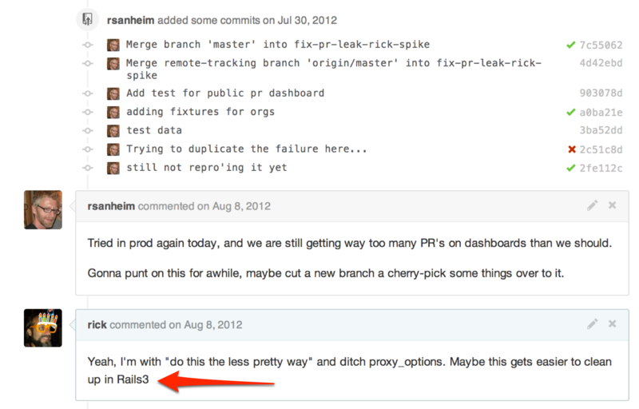
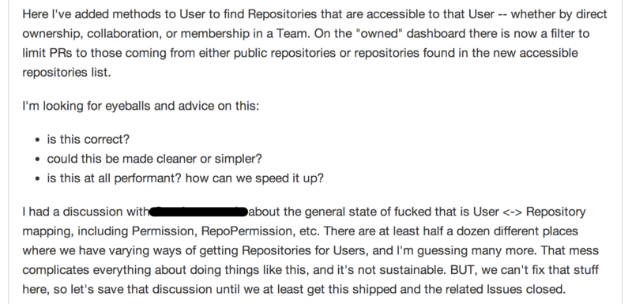
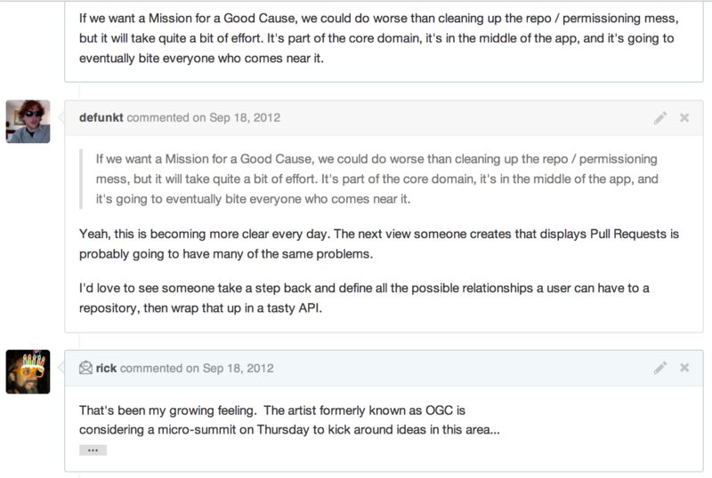
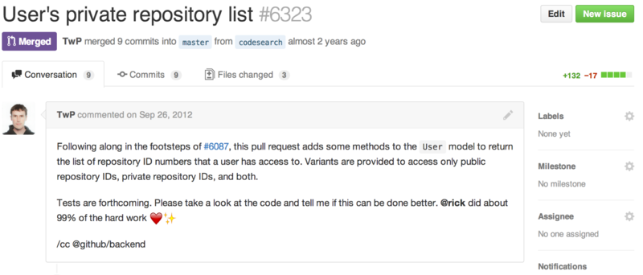
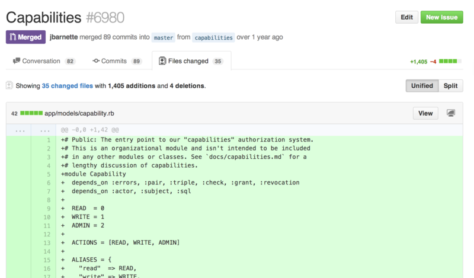
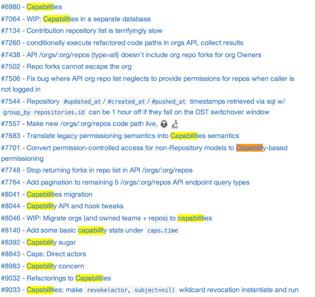
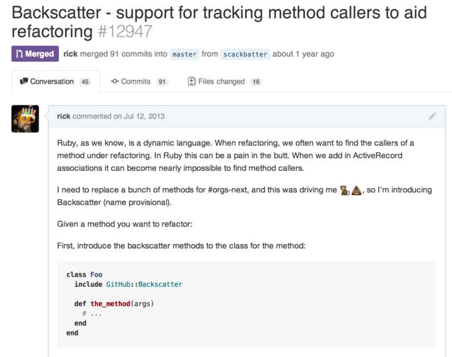
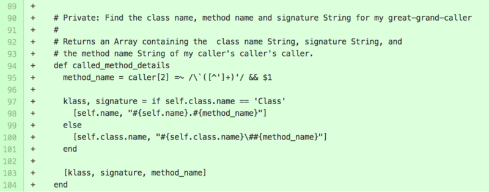
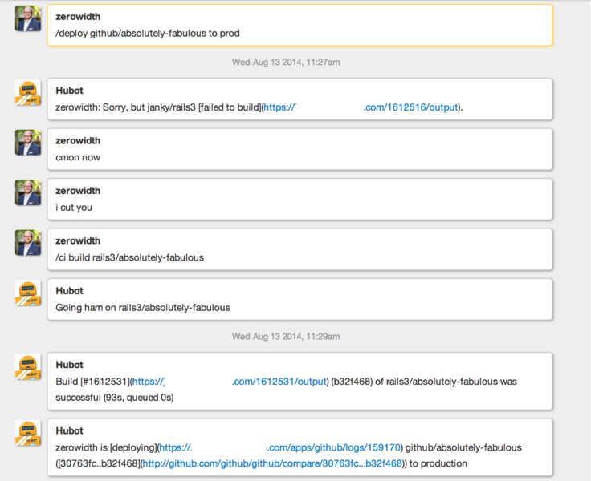

# Long Refactorings

 
 

## Rick Bradley
### GitHub, Inc.

---

### github.com/rick

---

## long refactorings
 

---

## long refactorings are simply refactorings
### only, (IN HINDSIGHT) they end up taking a lot longer than most refactorings

---

### Stepping back for a second...
## What *is* "refactoring"?

---

## Refactoring...

 

### **"behavior-preserving changes to the implementation of a system"**

---

---

 

 

 

`http://refactoring.com/catalog/extractMethod.html`

---

 

 

 

`http://refactoring.com/catalog/inlineMethod.html`

---

## **"behavior-preserving changes to the implementation of a system"**

 

### This is really only true for the smallest of refactorings.

 
 

### In larger-scale refactorings we're typically chaining together a series of behavior-preserving changes, interspersed with behavior changes.

 

### The important things are to always know which is which, and to do them intentionally.

---

## why do we refactor?

---

### **wankery**

---

### (primarily)

---

### but also...

---

### to understand the system

---

### to understand the system
### to bring behavior under test

---

### to understand the system
### to bring behavior under test
### to extract code for reuse

---

### to understand the system
### to bring behavior under test
### to extract code for reuse
### to improve some facet of the system (performance, memory use, coupling, cohesion, etc., etc., etc.)

---

### to understand the system
### to bring behavior under test
### to extract code for reuse
### to improve some facet of the system (performance, memory use, coupling, cohesion, etc., etc., etc.)
### to reuse existing code elsewhere

---

### to understand the system
### to bring behavior under test
### to extract code for reuse
### to improve some facet of the system (performance, memory use, coupling, cohesion, etc., etc., etc.)
### to reuse existing code elsewhere
### to make room for a new feature

---

### to understand the system
### to bring behavior under test
### to extract code for reuse
### to improve some facet of the system (performance, memory use, coupling, cohesion, etc., etc., etc.)
### to reuse existing code elsewhere
### to make room for a new feature
### to prepare to fix a bug

---

### to understand the system
### to bring behavior under test
### to extract code for reuse
### to improve some facet of the system (performance, memory use, coupling, cohesion, etc., etc., etc.)
### to reuse existing code elsewhere
### to make room for a new feature
### to prepare to fix a bug
### ...

---

### to understand the system
### to bring behavior under test
### to extract code for reuse
### to improve some facet of the system (performance, memory use, coupling, cohesion, etc., etc., etc.)
### to reuse existing code elsewhere
### to make room for a new feature
### to prepare to fix a bug

 

### (and usually, still, quite a bit of)

 

## wankery

---

## optimization
 
 

---

## optimization
 
### no, I mean, like, life optimization

---

## refactoring a toy system

---

## refactoring a toy system

### it could be for learning purposes
### or perhaps the hope is that some day it will grow up to be a big system
#### one that someone has a use for

---

## refactoring a toy system

### The value is in building something useful

 

### Even here, though, we have finite time and resources
### So we choose what to work on

---

## refactoring a system that people are actively using

---

### Again, limited time and resources,
### so we must make choices about what to work on,
### because the time spent on one thing cannot be spent on another.

---

## refactoring to understand a system
### &nbsp;

---

## refactoring to understand a system
### is useful if it is directed towards implementing a feature or fixing a bug
---

## refactoring to bring behavior under test
### &nbsp;
### &nbsp;

---

## refactoring to bring behavior under test
### &nbsp;
### &nbsp;

---

## refactoring to bring behavior under test
### is wasteful, unless it's being immediately driven by fixing a bug or implementing a feature

---

## refactoring to extract code for reuse
### &nbsp;
### &nbsp;

---

## refactoring to extract code for reuse
### is wasteful, unless we have reached the point where a new feature is ready to use that extraction

---

## refactoring to improve some facet of the system
### &nbsp;
### &nbsp;

---

## refactoring to improve some facet of the system
### is generally a good reason to refactor, if this is the most important thing you could be working on right now

---

## refactoring to make room for a new feature
### &nbsp;

---

## refactoring to make room for a new feature
### is great, presuming you're implementing that feature right now

---

## refactoring to prepare to fix a bug
### &nbsp;

---

## refactoring to prepare to fix a bug
### also great, if you're fixing the bug right now

---

---

## optimization
### part deux

---

## most refactorings are small or trivial

 

### There's really no estimation involved:
### look at the code, start making the changes.

 

### We're using techniques in Martin Fowler's _Refactoring_ book.

 

### The refactorings are a commit or few,
### inside the boundary of a larger pull request,
### dedicated to a feature or a bugfix.

---

## many refactorings are a bit larger

 

### Suitable for a pair of programmers working on an afternoon,
### we can estimate them fairly accurately or do without estimation.

 
### We can use simple tools and processes, like feature branches, pair programming, a second or third Pull Request.

 

### We start to use more advanced techniques.

---

## We start to draw on these techniques

 

### characterization testing, refactoring to tests, sensing variables, etc.

---

---

---

## We eventually encounter refactorings that we know are projects

---

## We eventually encounter refactorings that we know are projects

 

### These refactorings are non-trivial and perhaps not even possible.
### Even the process of estimation is difficult.

---

 

### We only consider them because they are roadblocks to important features, or there are real quality problems in this part of the system, and piecemeal attempts at bugfixing fail to eliminate problems.

---

### Developers who go into these areas come back angry and muttering, they turn to the solace of drink.

 

 

## Good people are reduced to bad things.

---

## Tackling these ugly jobs is what we're here to talk about.

---

## So how do we tackle these huge refactorings?

---

## There are enough risks that success is unlikely

 

### &nbsp;
### &nbsp;
---

## There are enough risks that success is unlikely

 

### So, aim to minimize costs.
### &nbsp;

---

## There are enough risks that success is unlikely

 

### Aim to never be a roadblock.
### &nbsp;

---

## There are enough risks that success is unlikely

 

### Avoid building the Second System™ -- the promised land of endless biscuits and gravy.

---

## There are enough risks that success is unlikely

 

### Integrate constantly.  Long-running branches are kryptonite.
### &nbsp;
---

## There are enough risks that success is unlikely

 

### Don't go in for Flag Day.
### &nbsp;
---

## There are enough risks that success is unlikely

 

### When the project "lands", it's quietly been in use for weeks or months already.
---

## There are enough risks that success is unlikely

 

### Be like water.
### &nbsp;

---

---

 

## Start with exploration

 

### Spec out possible alternate architectures as proofs of concept.
### &nbsp;

---

 

## Start with exploration

 

### Various people in ones and twos take stabs at feasibility over the course of months or years.

---

 

## Start with exploration

 

### Do throw-away experimental refactorings of a smaller scope just to see if a large refactoring might be possible.

---

 

### use techniques like those from _The Mikado Method_ to even explore the possible refactorings

---

 1. Start with a goal
 2. Do the first small refactoring along the way
 3. See what breaks -- write down a graph node
 4. Repeat until no more dependencies

---

## getting real

---

## "abilities"

---

**June 2012**

---

**July 2012**

---

**July 2012**

---

**July 2012**

---

**July 2012**

---

**August 2012**

---

**September 2012**

---

**September 2012**

---

**September 2012**

---

**September 2012**

---

**November 2012**

---

## A Long Refactoring Kicks Off

### Ongoing quality problems in an important part of the system
### Repeated bugfixing did not improve quality significantly
### High level feature changes roadblocked by this core subsystem

---

---

## The Abilities project:

 

### 4 primary developers
### 795 Pull Requests and Issues from November 2012 until August 2014

 

### Multiple iterations of complete new permissioning systems
### Tight collaboration with ongoing Organization improvements

---

## (let's look at those issues)

---

---

**November 2012**

---

### Capabilities lived as a new permissions system, side-by-side with existing permissions until August, 2013

---

### Until Abilities came onto the scene.

### Extensive performance testing led us to remodel capabilities so that granting operations were more performant

---

## How did we know?

---

---

---

### We built tools to let us (and anyone) run two code paths side-by-side.
### Then performance data is published by instrumentation into our graphite cluster.

---

---

## Don't Roadblock

 

### Long-running branches are kryptonite.
### We can land short-lived branches to "dark ship" new code.
### With science and instrumentation tools we can gather real production measurements in a controlled fashion.

---

## How to run two permission systems at the same time

### One system is the source of all truth.
### Have a migrator that creates the second system's data from the first.
### The data for the second system is updated by actions on the first system.
### Start with just a subset of users.
### Trash the data and re-run the migrator.
### Eventually never re-run the migrator.

---

---

## The project will ebb and flow

 

### Always have enough side project work available that you can stay fresh and not get bogged down.
### People will come and go (and often return) on a truly long refactoring.
### You will be at an impasse many times.
### Rely on your team, and allow yourself to experiment with crazy things.
### Your creativity is an asset.

---

### Sometimes it's just hard to figure out if the code you are changing is even being used. Try to be 100% safe.

---

---

### Just a glorified wrapper around ruby's `caller` method.

---

### ... which can be put to holy or horrible uses.
---

### Because, really, we're all such horrible people.

---

## Staying alive

 

### Keep your sense of humor.
### Rely on your peoples.
### Keep close.
### Work-life balance is important.
### This is a marathon.
### Take a vacation.
### You actually can leave and do something else.
### It's fine.

---

## Setbacks

 

### Repository Networks were all jacked up at the model level.
### &nbsp;
### &nbsp;

---

## Setbacks

 

### Repository Networks were all jacked up at the model level.
### "plan owner" data was all shitty due to old bad job processes.
### &nbsp;

---

## Setbacks

 

### Repository Networks were all jacked up at the model level.
### "plan owner" data was all shitty due to old bad job processes.
### Forking and collaborators were all sorts of stupid.

---

## Setbacks

 

### You re-learn that you everything is connected.
### You end up having to fix way more things than you hoped.
### And you make some trade-offs and draw boundaries.

---

## Setbacks

 

### So we wrote data quality scripts to find problems.
### We wrote transition scripts to clean up problems.
### We wrote throttling tools to make massive transitions never hurt production.

---

---

## Estimation

### There is no way I have seen to estimate a long refactoring.
### What you can do is not be a blocker, and continue to negotiate what is the most important thing to fix Right Now.

---

## Enterprise

---

## Enterprise

### Installed GitHub instances behind company firewalls.
### Often 6 months behind github.com code base.
### Customers can be 300+ days behind last Enterprise release.
### We have almost zero visibility into installed versions and data quality at a customer's site.
### There are disabled and enabled github.com features on Enterprise.

---

## Enterprise

### Data transitions for github.com are bundled with migrations for Enterprise upgrades.
### Database tables and ActiveRecord models persist in github.com code until Enterprise is fully upgraded.

---

## Shipping

---

## Shipping

### Made abilities be the "source of truth" for read queries on teams, and orgs.
### Made abilities be the "source of truth" for repository read queries.
### Continue writing data to *both* permissions systems.
### Gradual removal of science experiment code.

---

---

---

---

---

---

## Image credits:

https://www.flickr.com/photos/mozul/31304173/
https://www.flickr.com/photos/uspn/4894253589/
https://www.flickr.com/photos/nate_marsh/5213604228/
https://www.flickr.com/photos/steveallen/3324325493/
https://www.flickr.com/photos/ckrug/162099232/
https://www.flickr.com/photos/slagheap/156203875/
https://www.flickr.com/photos/j3net/480637896/
https://www.flickr.com/photos/jmabel/4516193497/
https://www.flickr.com/photos/27271711@N04/3643199789/
https://www.flickr.com/photos/pixbymaia/9662665997/
https://www.flickr.com/photos/usnavy/7070501561/
https://www.flickr.com/photos/loshak/4839254506/

**Note: dat rooster is origin unknown**

---

- rails3
  - ongoing (2011 -> now)
  - backporting strategy; overwhelmed by code changes; long branch
  - guard-based strategy to backport all version changes to master
  - aggressive graphing and logging
  - staying out of the way of enterprise branch points
  - reworking our script/* directory and configuration to allow toggling rails versions easily
- smoke -> gitrpc
  - just completed, 2011 -> now
  - piecewise replacement of one git layer with another
  - graph instrumentation, exception tracking, extensive use of backscatter
  - gradual increase in callers of gitrpc -- 20%, 40%, 50%, 80%, 90%, 95%, 98%, 99%, 99.5%, 99.9%, .... 100%

 -> TODO: put the d3-type stuff here.

 -> something about team dynamics
 -> commitment to engineering over marketing, e.g.

 - need something conclusory...
